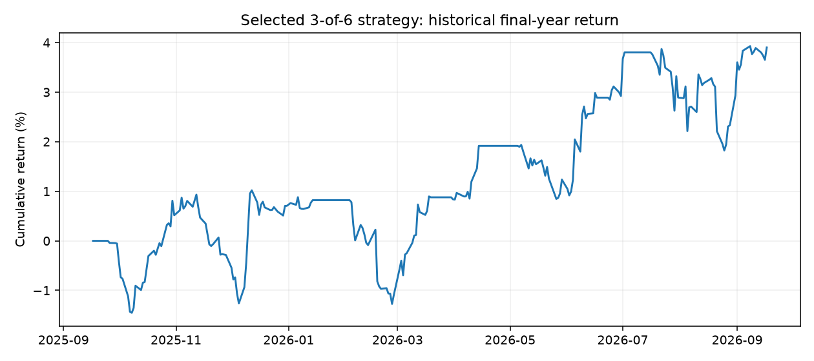

# Research results

The current official strategy produced **+3.90% net return** in a historical backtest over September 17, 2025–September 17, 2026 on a modeled $100,000 account.

The project demonstrates a reproducible research pipeline: training-only K-means screening, cointegration and recovery diagnostics, causal signal generation, explicit two-leg accounting, and saved trade-level evidence. The observed returns are modest after costs, and the additional historical checks show sensitivity to the period and selected pairs.

## Comparable saved evaluations

| Evaluation | Trading dates | Net total return | Gross total return | Net CAGR | Max drawdown | Trades | Pairs |
|---|---|---:|---:|---:|---:|---:|---:|
| Current official weighted 3/6 | 2025-09-17–2026-09-17 | 3.90% | 5.78% | 3.90% | 2.27% | 22 | 3 |
| Frozen-rule historical 2021 check | 2021-01-04–2021-12-31 | 1.00% | 2.92% | 1.01% | 4.12% | 40 | 6 |
| Temporary ten-year-data preview | 2024-09-18–2026-09-17 | 8.45% | 11.71% | 4.15% | 4.96% | 22 | 2 |

Net returns include the modeled trading and borrowing costs. Gross returns remove those costs; they do not add interest on cash. CAGR uses actual elapsed calendar time. Drawdown is shown as a positive loss magnitude. The preview uses ten years of data but trades for the final **two** years; its 8.45% is a two-year total return, not an annual return. These runs have different trading periods and pair sets, so their returns do not isolate a single parameter's effect.

| Evaluation | Gross P&L | Trading + borrowing costs | Net P&L | Ending account |
|---|---:|---:|---:|---:|
| Current official | $5,783.54 | $1,882.72 | $3,900.81 | $103,900.81 |
| Historical 2021 | $2,920.17 | $1,923.99 | $996.17 | $100,996.17 |
| Temporary preview | $11,708.94 | $3,255.01 | $8,453.93 | $108,453.93 |

## Current official allocation

Weights are proportional to the number of passing formation periods divided by the mean p-value across all six periods. They are fixed before the replay, with no 20% allocation cap. Untraded sleeve budgets remain cash.

| Pair | Periods with p < 0.05 | Mean p across all six | Weight | Allocated net P&L |
|---|---:|---:|---:|---:|
| EVRG–WELL | 4/6 | 0.1650 | 40.44% | $704.83 |
| MCO–SPGI | 3/6 | 0.1205 | 41.54% | $1,370.75 |
| ITW–NXPI | 3/6 | 0.2778 | 18.01% | $1,825.24 |

Weights sum to 100% before rounding. The mean p-value is a descriptive allocation input, not a combined significance test. The official 3.90% version uses the persistence-based weighting rule. An earlier equal-thirds allocation of the same three pairs returned 5.06% over the same historical period.

## What the additional checks show

The **2021 check** re-estimated pairs, hedge ratios, recovery diagnostics and weights using only 2017–2020 prices, then traded January–December 2021 with the current rules. This retrospective robustness check returned 1.00% net.

The **temporary preview** used eight development years and ten overlapping annual screens, requiring p < 0.05 in at least 5/10 including the latest. It is a separate historical experiment, not the default strategy. Profit was concentrated in ES–EVRG: that pair contributed **+$10,153.88**, while BXP–PSA contributed **−$1,699.95**, leaving +$8,453.93 overall. Two pairs and one dominant contributor do not establish broad robustness.

For a fixed pair set and fixed rules, checks that changed later prices left earlier signals and equity unchanged, verifying implementation chronology. The engine uses modeled costs and adjusted close proxies, credits no cash interest, and does not reproduce all broker financing, margin, short-locate or dividend cash flows.

## Evidence and reproduction

Compact saved evidence is retained for review:

- Current official: [performance](../reports/selected-2025-2026/performance.csv), [allocation](../reports/selected-2025-2026/allocation.csv), [selected fits](../reports/selected-2025-2026/selected-pairs.csv), [trades](../reports/selected-2025-2026/trades.csv), [pair metrics](../reports/selected-2025-2026/pair-metrics.csv), [equity](../reports/selected-2025-2026/equity.csv).
- Historical 2021: [performance](../reports/historical-2021/performance.csv), [allocation](../reports/historical-2021/allocation.csv), [selected fits](../reports/historical-2021/selected-pairs.csv), [trades](../reports/historical-2021/trades.csv), [pair metrics](../reports/historical-2021/pair-metrics.csv), [equity](../reports/historical-2021/equity.csv).
- Temporary preview: [performance](../reports/ten-year-preview/performance.csv), [allocation](../reports/ten-year-preview/allocation.csv), [pair metrics](../reports/ten-year-preview/pair-metrics.csv).
- [Provenance manifest](../reports/manifest.json) records source filenames and SHA-256 hashes. [Methodology](methodology.md) defines the implementation and evaluation process.

The `Allocated_Profit` column in pair metrics is the pair's contribution to the combined account. The remaining pair performance columns describe a standalone $100,000 sleeve before scaling; they must not be added directly. Included CSVs support metric reconciliation and record review. The [frozen official inputs](../reproducibility/selected/README.md) also support exact default replay from a fresh clone. Source-price snapshots for the historical 2021 check and temporary preview are not included in these compact reports.
