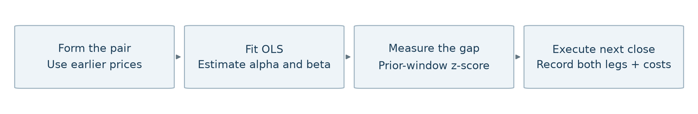
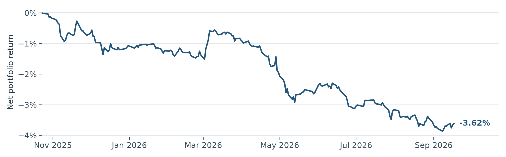
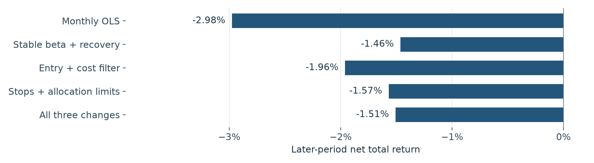
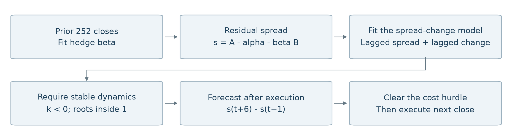
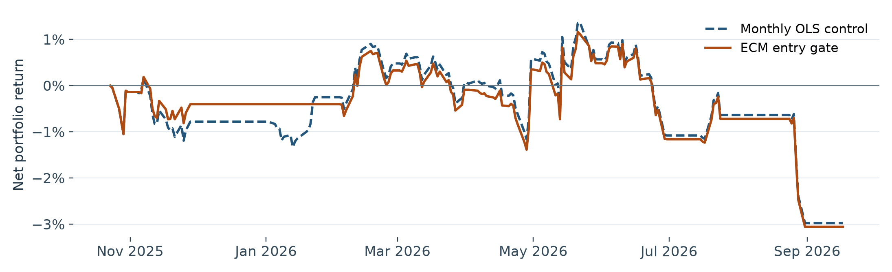

# Pairs trading: what the research shows

Project brief | 2026-09-18 23:14 EDT | Cached US stock prices through 2026-09-17

**Research question:** can deviations between related stock prices predict a trade that remains profitable after execution costs?

**Current result:** the 494-stock study returns **-3.62%**, a loss of **$3,617.09**, in the later period. The five completed 50-stock variants also lose money later. A new linear error-correction entry gate is evaluated separately on pages 5-6.

## Two study sizes, kept separate

| Study | Universe and selection | Purpose |
| --- | --- | --- |
| Full baseline | 494 retained stocks; 52 fixed pairs; 84 distinct selected stocks | Describe the assignment strategy and all-pair portfolio. |
| Research pilot | Fixed 50-stock sample; 100 same-industry hypotheses per monthly screen | Compare specific rule changes under matched costs and execution. |

| Baseline period | Dates | Daily closes |
| --- | --- | --- |
| Training / formation | 2023-09-19 to 2025-10-22 | 526 |
| Later historical test | 2025-10-23 to 2026-09-17 | 226 |

## What the baseline actually trades

- Select same-sub-industry pairs with positive beta, different issuers, provisional I(1) compatibility and raw training cointegration p < 0.05.
- Fit A = alpha + beta x B + residual. Trade the spread A - beta x B using a z-score based on the preceding 60 closes.
- Enter beyond +/-2; exit toward +/-0.5, after 20 trading intervals, or at the period end. A close-based signal executes at the following close.
- Divide one $100,000 account equally across all 52 pairs; keep hedge shares fixed within each trade. Idle capital remains cash.
- Charge 0.10% of actual traded dollars on entry and exit of both legs, plus 2% annual short borrowing.

**Interpretation:** cointegration is a property of a price combination under statistical assumptions. A low p-value is not a profitability score. Training performance is fitted; the later period has already informed research, so it is not an untouched holdout.

This brief explains the decisions. The linked full report and CSVs preserve the detailed assignment outputs (page 8).

<!-- pagebreak -->

## 1. From regression to an actual two-stock trade

**Figure 1. Procedure for the historical simulation.** Pair selection and regression precede the period being traded; order execution follows signal observation.

### What linear regression contributes

| Object | Meaning in this project |
| --- | --- |
| A = alpha + beta x B + residual | OLS finds the fitted price relationship by minimizing squared residuals. |
| beta | The hedge uses beta shares of B for each share of A; it is not a percentage portfolio weight. |
| Spread = A - beta x B | The trading gap; its average need not be zero because the intercept can be nonzero. |
| z = (spread - prior mean) / prior standard deviation | A unit-free measure of how unusual the current gap is relative to recent history. |

### Worked share hedge: an illustration, not an observed trade

Suppose A costs $110, B costs $50, and the fitted beta is 2. The spread is $10. If it is unusually high, the strategy shorts A and buys B. With a $1,000 gross entry allocation:

| Quantity or result | Calculation |
| --- | --- |
| Units of A | 1,000 / (110 + 2 x 50) = 4.7619 shares sold short |
| Units of B | 2 x 4.7619 = 9.5238 shares bought |
| If A falls to $104 and B stays $50 | Gross profit = 4.7619 x $6 = $28.57 |
| Entry + exit trading cost at 0.10% | $1.00 + $0.9714 = $1.9714 |
| Profit after those trading fees | $26.60 before short-borrow expense; borrowing depends on elapsed days. |

The price move is hypothetical. A spread can continue widening, the fitted relationship can change, and a delayed exit can lose more than the value suggested by a threshold.

Method sources: [Statsmodels OLS](https://www.statsmodels.org/stable/generated/statsmodels.regression.linear_model.OLS.html) and [Engle-Granger cointegration](https://www.statsmodels.org/stable/generated/statsmodels.tsa.stattools.coint.html).

<!-- pagebreak -->

## 2. Full baseline: 494 stocks, all 52 selected pairs

The original screen saved 5,734 raw candidates from 121,771 pair combinations. Additional strategy filters retain 52 pairs. No pair is dropped from this portfolio because it later loses money.

| Metric | Training | Later period |
| --- | --- | --- |
| Net total return | 11.04% | -3.62% |
| Annualized return | 5.13% | -4.01% |
| Annualized volatility | 1.64% | 1.75% |
| Sharpe; zero risk-free rate | 3.06 | -2.34 |
| Maximum drawdown | -0.65% | -3.87% |
| Closed pair trades | 520 | 246 |
| Win rate, after costs | 70.00% | 50.41% |
| Fees + borrowing | $2,542.58 | $1,256.39 |

**Figure 2. Later-period net return, 2025-10-23 to 2026-09-17.** One $100,000 account, equal fixed pair allocations and the stated trading/borrowing costs.

Source: [Baseline daily account CSV](../../results/2026-09-18_17-58-16_complete-research-report_494-stocks/2026-09-18_17-58-16_complete-research-report_494-stocks_later-daily-portfolio.csv); [complete performance metrics CSV](../../results/2026-09-18_17-58-16_complete-research-report_494-stocks/2026-09-18_17-58-16_complete-research-report_494-stocks_performance-comparison.csv).

**Coverage and caution:** [The clean eight-page report](../../results/2026-09-18_21-29-27_pairs-trading-clean-report_494-stocks/2026-09-18_21-29-27_pairs-trading-clean-report_494-stocks_report.pdf) lists every selected pair's p-values and net profit on pages 3-4. Raw p-values are exploratory; none of the original candidates clears the conservative Bonferroni threshold across all 121,771 tests. Stationary-price hubs are flagged rather than advertised as the best trading stocks.

<!-- pagebreak -->

## 3. Separate pilot: five OLS variants on 50 stocks

Each variant uses monthly screens on the preceding 252 closes. Positions close at monthly boundaries; each method's remaining capital carries forward within a fold. Each fold starts a separate $100,000 account. Costs are 10 basis points per traded dollar plus 2% annual borrowing.

| Earlier fold 1 | Earlier fold 2 | Later comparison |
| --- | --- | --- |
| 2024-09-19 to 2025-03-31 | 2025-04-01 to 2025-10-22 | 2025-10-23 to 2026-09-17 |

| Variant | Earlier 1 | Earlier 2 | Later | Later trades |
| --- | --- | --- | --- | --- |
| Monthly OLS | 1.31% | 1.65% | -2.98% | 30 |
| Stable beta + recovery | 0.90% | 1.13% | -1.46% | 19 |
| Entry + cost filter | 0.50% | 0.44% | -1.96% | 18 |
| Stops + allocation | -0.31% | 0.43% | -1.57% | 27 |
| All three changes | 0.52% | -0.10% | -1.51% | 14 |

**Figure 3. All five pilot variants lose money in the later comparison.** US 50-stock sample, 2025-10-23 to 2026-09-17; total return after stated costs.

Stable beta adds recovery-speed and hedge-stability checks. The entry filter waits for movement back toward zero and a cost-distance hurdle. The risk version adds an adverse z stop, a shorter holding cap, non-overlapping tickers and an allocation cap. The final row combines all three.

**No independent holdout:** these ideas followed earlier inspection of the later period. The baseline was selected using a predefined earlier-fold gate; that does not erase the earlier inspection or establish statistical significance. These 50-stock outcomes must not be compared directly with the 52-pair baseline to isolate a rule's effect.

Source: [All five-variant, three-period statistics CSV](../../results/2026-09-18_22-52-31_ols-strategy-improvement_50-stocks/2026-09-18_22-52-31_ols-strategy-improvement_50-stocks_all-performance.csv) and [exact rules and full pilot records](../../results/2026-09-18_22-52-31_ols-strategy-improvement_50-stocks/2026-09-18_22-52-31_ols-strategy-improvement_50-stocks_report.md).

<!-- pagebreak -->

## 4. New hypothesis: forecast whether the spread can repay its costs

The additional strategy retains linear regression. It asks whether a fitted correction model projects enough movement in the intended direction after the order can execute. Its exact rules were fixed before this new simulation.

**Figure 4. The error-correction entry gate.** Same 50 stocks and monthly selection as the pilot; only the additional entry gate differs from its matched OLS control.

### Exact model and entry condition

Fit the formation residual s = A - alpha - beta x B, then fit:

**Delta s(t) = a + k x s(t-1) + g x Delta s(t-1) + error.**

Require full regression rank, k < 0 and both implied AR(2) companion roots strictly inside the unit circle. Freeze the fitted coefficients for that month's decisions. This is one residual-spread equation, not a full vector error-correction model.

At a baseline z-score entry opportunity, use today's residual and change to forecast s(t+1) and s(t+6). Direction d is +1 for a long spread and -1 for a short spread. Enter only if:

**d x [forecast s(t+6) - forecast s(t+1)] / [price A + beta x price B] > 2 x estimated round-trip cost.**

The cost estimate is 2 x 0.001 + 0.02 x 7/365.25 x the entry short-leg fraction. Actual charged costs still use executed dollar amounts and actual holding days. The projected interval excludes the next-close execution gap; the five-interval forecast is an entry heuristic, not a new exit deadline or a guaranteed return.

Same baseline z thresholds, equal allocation, 20-bar cap, monthly liquidation and next-close execution remain in place. Cash earns zero interest. The exact gate is this project's research hypothesis; the general error-correction formulation is described in [Statsmodels VECM documentation](https://www.statsmodels.org/stable/generated/statsmodels.tsa.vector_ar.vecm.VECM.html).

<!-- pagebreak -->

## 5. New strategy result: compare the matched control

Both methods use the same fixed 50-stock sample, monthly 252-close formation, periods and costs. Each cell below is the return of a separate $100,000 account; do not compound the three periods as one continuous strategy.

| Period | OLS control | ECM gate | Change (pp) | Trades: OLS / ECM |
| --- | --- | --- | --- | --- |
| Earlier 1 | 1.31% | 1.31% | +0.002 | 36 / 34 |
| Earlier 2 | 1.65% | 0.90% | -0.747 | 17 / 13 |
| Later | -2.98% | -3.06% | -0.081 | 30 / 29 |

Change is ECM minus control in percentage points (pp); it is rounded to three decimals.

**Figure 5. Matched later-period cumulative return, 2025-10-23 to 2026-09-17.** The solid orange line includes the additional forecast gate; the dashed blue line is its OLS control.

| Later-period measure | OLS control | ECM gate |
| --- | --- | --- |
| Maximum drawdown | -4.28% | -4.17% |
| Trading + borrowing costs | $1,907.39 | $1,767.19 |
| Closed trades | 30 | 29 |

**What this establishes:** The ECM version still loses money in the later period. The forecast gate changes which trades occur. Differences in exposure, idle cash and selection can affect return and drawdown; this single run does not establish a durable edge.

**What it cannot establish:** the two earlier folds are development data and the later period has already been examined. The new rule is not a fresh holdout test, even though its settings were recorded before this run.

Source: [All ECM/control period statistics CSV](../../results/2026-09-18_23-11-02_linear-ecm-forecast-gate_50-stocks/2026-09-18_23-11-02_linear-ecm-forecast-gate_50-stocks_all-performance.csv) and [ECM experiment report and trade records](../../results/2026-09-18_23-11-02_linear-ecm-forecast-gate_50-stocks/2026-09-18_23-11-02_linear-ecm-forecast-gate_50-stocks_report.md).

<!-- pagebreak -->

## 6. What the evidence answers - and what remains

| Research question | Answer supported by these saved results |
| --- | --- |
| Does correlation establish cointegration? | No. Return co-movement and a stationary price combination are different properties. |
| Did the 52 fixed relationships persist? | 2 of 52 later Engle-Granger retests have raw p < 0.05; these refits are diagnostics, not past trade selectors. |
| Are thresholds important? | All nine baseline later threshold variants lose money: -4.09% to -2.72%. |
| Do costs explain the whole loss? | No. The 494-stock baseline loses 2.36% before costs and 3.62% after costs. |
| Is profit concentrated? | Five winning trades supply 16.7% of positive net trade profit. There are 21 profitable and 31 losing baseline pairs. |
| Has live viability been established? | No. The studies omit executable quotes, impact, margin constraints and borrow recalls; no untouched final period remains. |

### The next experiment should improve the evidence

1. Obtain a longer, point-in-time universe and price history, with executable bid/ask information and borrowing assumptions where possible.
2. Keep a chronological development set and a genuinely unexamined final period. Record the candidate methods and decision rule before evaluation.
3. Test the cointegration cutoff, hedge lookback, stop and holding limit on the development folds. Account for multiple pair tests and repeated strategy trials.
4. Check stock-level exposure, liquidity and cost stress. Compare risk and capital usage alongside return so that extra cash is not mistaken for a better signal.
5. Freeze one specification before forward paper trading. Preserve losses and rejected ideas in the research record.

The individual-price I(1) checks are provisional. Current index membership and full-period data availability introduce historical selection. Adjusted closes, fractional shares and assumed short availability simplify execution. The early full-baseline in-sample return uses pairs and a hedge fitted on that same window.

**Assignment status:** all eleven expected output types are available through the index on the next page. Parameter optimization is still incomplete: the project has tested several variants and thresholds, but has not established a validated optimum or live profitability.

<!-- pagebreak -->

## 7. Evidence index and presentation sources

This brief supplements the detailed results. [Open the clean eight-page baseline report](../../results/2026-09-18_21-29-27_pairs-trading-clean-report_494-stocks/2026-09-18_21-29-27_pairs-trading-clean-report_494-stocks_report.pdf) for the full pair table, sample trade log, spread/z-score plots, sensitivity and performance measures.

| Requested assignment output | Where to read it | Machine-readable record |
| --- | --- | --- |
| Candidate table / heatmap | Clean report pp. 3-4: all 52 pairs | [Pair statistics CSV](../../results/2026-09-18_17-58-16_complete-research-report_494-stocks/2026-09-18_17-58-16_complete-research-report_494-stocks_selected-pairs-statistics.csv) |
| Cointegration p-value table | Clean report pp. 3-4 | [All 5,734 raw candidates CSV](../../results/2026-09-18_17-58-16_complete-research-report_494-stocks/2026-09-18_17-58-16_complete-research-report_494-stocks_all-candidate-p-values.csv) |
| Selected spread chart | Clean report p. 5 | [CPT-ESS signal data CSV](../../results/2026-09-18_17-58-16_complete-research-report_494-stocks/2026-09-18_17-58-16_complete-research-report_494-stocks_cpt-ess-later-signals.csv) |
| Z-score + entry / exit lines | Clean report p. 5 | [AEP-DUK signal data CSV](../../results/2026-09-18_17-58-16_complete-research-report_494-stocks/2026-09-18_17-58-16_complete-research-report_494-stocks_aep-duk-later-signals.csv) |
| Backtest equity curve | Clean report p. 2 | [Daily account CSV](../../results/2026-09-18_17-58-16_complete-research-report_494-stocks/2026-09-18_17-58-16_complete-research-report_494-stocks_later-daily-portfolio.csv) |
| Trade log | Clean report p. 7: sample | [Complete later trades CSV](../../results/2026-09-18_17-58-16_complete-research-report_494-stocks/2026-09-18_17-58-16_complete-research-report_494-stocks_later-trade-log.csv) |
| Training vs later performance | Clean report p. 2 | [Period metrics CSV](../../results/2026-09-18_17-58-16_complete-research-report_494-stocks/2026-09-18_17-58-16_complete-research-report_494-stocks_performance-comparison.csv) |
| Sharpe, return, volatility, drawdown | Clean report p. 2 | Same period metrics CSV |
| Win rate, trade return, turnover | Clean report p. 2 | Same period metrics CSV |
| Entry / exit sensitivity | Clean report p. 6 | [All threshold results CSV](../../results/2026-09-18_17-58-16_complete-research-report_494-stocks/2026-09-18_17-58-16_complete-research-report_494-stocks_threshold-sensitivity.csv) |
| Overall cumulative return | Clean report p. 2; brief p. 3 | Same daily account CSV |

### Study records

- Baseline assumptions and reconciliation: [494-stock baseline metadata](../../results/2026-09-18_17-58-16_complete-research-report_494-stocks/2026-09-18_17-58-16_complete-research-report_494-stocks_run-metadata.json).
- All pilot variant/period pair contributions: [50-stock pilot pair profits CSV](../../results/2026-09-18_22-52-31_ols-strategy-improvement_50-stocks/2026-09-18_22-52-31_ols-strategy-improvement_50-stocks_all-pair-profits.csv).
- New experiment: [linear error-correction report](../../results/2026-09-18_23-11-02_linear-ecm-forecast-gate_50-stocks/2026-09-18_23-11-02_linear-ecm-forecast-gate_50-stocks_report.md) and its linked plan, selection, account and trade records.

### Why this presentation is different

Following the UK Government Analysis Function's [chart guidance](https://analysisfunction.civilservice.gov.uk/policy-store/data-visualisation-charts/) and [table guidance](https://analysisfunction.civilservice.gov.uk/policy-store/data-visualisation-tables/), the brief uses one main message per figure, titles and source links in document text, short readable tables, direct values, light gridlines and zero-based bar axes. Chart descriptions accompany the figures; numerical tables and full CSV records remain available. This is a presentation improvement, not a claim of formal PDF accessibility certification.

The project calculations use locally saved market data. External sources support statistical definitions and design choices; they do not certify this project's returns. The separate learning textbook explains the mathematics and exercises in greater depth.
