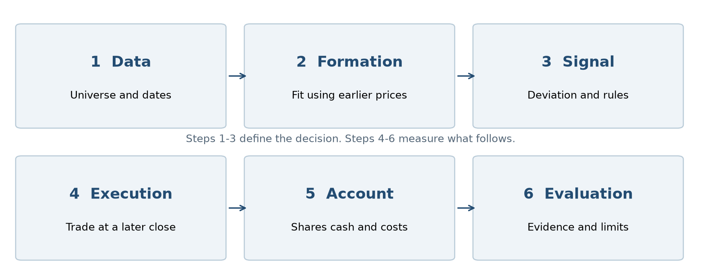
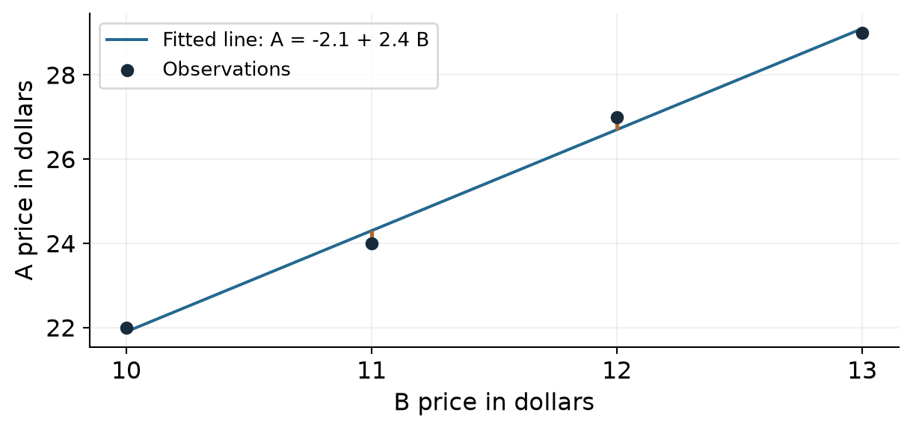
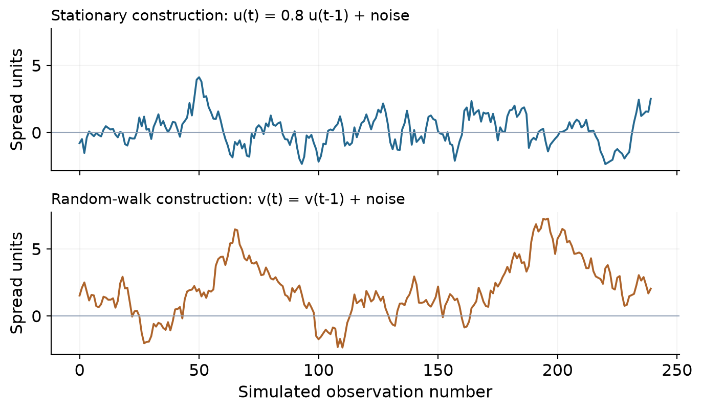

# A learning book for your quant project

Pairs trading with linear regression

This book is for you as you build and explain your first quantitative trading project. It teaches the financial arithmetic, statistical reasoning, Python workflow and research habits behind the code. You should be able to trace one signal from a price table to a pair of positions, calculate its profit, and explain why a good-looking backtest may not predict future success.

Use three reading passes. First read Chapters 1, 2, 6 and 10 for the overall story. Then work through the regression and accounting examples with a calculator. Finally use the dictionary, exercises and code map while running your project. The examples labeled **illustration** are invented for teaching. Tables labeled **project result** come from saved simulations; they are not live trading results.

The main conclusion from the project so far is that its current simulations do not establish a dependable positive trading edge. That is a useful research finding. Your task is to understand the mechanism, measure it correctly and distinguish a plausible hypothesis from evidence that survives independent checking.

<!-- contents -->

## 1 What a quant project actually does

**Learning objective:** explain the complete research question before discussing a model.

A quantitative trading project converts an economic idea into a measurable rule. In this project, the idea is that some related companies may have a relatively stable price relationship. When their relative prices move away from that relationship, buying one and shorting the other might benefit if the relationship recovers. Neither related businesses nor an attractive historical chart guarantees recovery.

The research question is therefore specific: after choosing pairs using information available at the time, can a rule based on their regression spread earn a positive return after fees, borrowing and delayed execution? The words "available at the time" and "after costs" are part of the question, not optional improvements to add after finding a profitable chart.

There are several different objects in the project. A **model** estimates a relationship, such as a regression slope. A **signal** converts observations into an instruction such as long, short or flat. A **portfolio rule** decides how much capital to allocate. A **backtester** accounts for shares, cash and costs. A **report** communicates the evidence. A mathematically sensible model can produce a poor trading strategy if entry timing, sizing or costs are unfavorable.

### Is this machine learning

OLS regression is a statistical method that is also used in supervised machine learning. Calling it machine learning does not change what it calculates. Our core model is interpretable: one stock price is related to an intercept and a multiple of another stock price. Cointegration testing, position accounting and research design are additional parts of the system. No neural network is needed for this project.

### The research chain



**Check yourself:** if the regression fits well but the trading account loses money, is the code necessarily wrong? No. The relationship may be economically too weak, unstable, costly or slow to exploit. Accounting must still be verified independently.

## 2 Stocks returns and long and short positions

**Learning objective:** calculate what each side of a pair earns and understand the money committed to it.

Owning a stock is a **long position**. If you buy 10 shares for $100 each and sell them for $103, the price gain is 10 x ($103 - $100) = $30 before costs. A **short position** involves selling borrowed shares and later buying shares back to return them. Short 15 shares at $50 and buy them back at $49: the price gain is 15 x ($50 - $49) = $15. A price increase hurts a short position. Borrowing, margin and recall constraints also matter in practice. [Investor.gov on long and short positions](https://www.investor.gov/introduction-investing/investing-basics/how-stock-markets-work/stock-purchases-and-sales-long-and) explains the mechanics.

### Prices and returns answer different questions

The simple return from yesterday to today is r = P_today / P_yesterday - 1. A move from $100 to $105 is +5%. A subsequent move back to $100 is -4.7619%, not -5%. Compounded returns multiply: (1 + r1)(1 + r2) - 1. Adding percentages is only an approximation for small changes.

The log return is log(P_today / P_yesterday). Log returns add across time; simple returns map directly to account growth. For the $100 to $105 move, the log return is about 4.879%, while the simple return is 5%. State which one you use. Our performance reports calculate changes in account value; the current hedge regression uses adjusted price levels.

### Gross and net exposure

For the 10-share long and 15-share short example, entry gross notional is $1,000 + $750 = $1,750. Signed net exposure is $1,000 - $750 = $250. A small net dollar exposure does not imply low risk: both positions can lose together, and their relationship can change.

A regression hedge is not automatically dollar neutral or market-beta neutral. If beta is 1.5 shares of B per share of A, the correct hedge depends on that slope and the prices. Buying $1,000 of each stock is a different rule. **Leverage** compares exposure with account equity; **allocation** describes how much of the account is assigned to this pair.

**Worked illustration:** 10 long shares of A and 15 short shares of B produce $45 gross profit in the price move above. With $1,750 entry gross notional, gross trade return is 45 / 1,750 = 2.5714%. With a $10,000 total account and the rest idle, the gross account return is 0.45%. These denominators describe different things.

## 3 Turn market data into a research dataset

**Learning objective:** know what a row, column, ticker and date mean before fitting anything.

Your price table has trading dates as rows and tickers as columns. A cell contains an adjusted closing price. Metadata is a separate table containing security names, industry classifications and issuer identifiers. Keep the raw download, cleaning decisions and final research table separately so another person can reconstruct which observations were used.

A ticker is a security label, not always a distinct company. Multiple share classes can share an issuer. The project's screen removes same-issuer combinations from its peer strategy. There are also more than 500 security tickers in some S&P 500 snapshots because companies can have multiple classes. The saved project snapshot requested 503 securities and retained 494 complete histories; these are snapshot counts, not permanent facts about the index.

### Cleaning has consequences

Verify chronological dates, unique rows, finite positive prices and aligned trading sessions. Record missing histories and the reason for exclusion. Do not silently fill a long suspension or pre-IPO history with invented prices. Forward-filling can create a misleadingly smooth series or stale price relationship.

Adjusted closes account for corporate actions according to the data provider's conventions. They are useful for research but are not necessarily historical executable quotes. A trade simulation on adjusted prices abstracts from detailed share changes, cash dividends and brokerage treatment. This simplification belongs in the report.

Using today's constituent list to study the past creates **survivorship and membership bias**. Requiring a complete history across the entire later period can also use future availability when choosing stocks. The existing project has these limitations. A stronger dataset would reconstruct the securities and information available at each historical date.

### The saved sample

The full cached history runs from September 19, 2023 to September 17, 2026. The 50-stock pilot uses ten sub-industries with five stocks each and a recorded random seed of 42. There are 10 possible within-industry pairs per group, hence 100 peer hypotheses. This is much smaller than all 50 choose 2 = 1,225 combinations because cross-industry pairs are deliberately excluded.

The sample used current metadata and a previous availability screen. Its seeded draw makes it reproducible, but does not remove historical membership bias. **Reproducible** means another run can follow the same process; **unbiased** means something different.

## 4 Linear regression from arithmetic to hedge ratio

**Learning objective:** calculate a slope, distinguish a fitted value from a residual, and connect beta to shares.

Write the model as P_A,t = alpha + beta x P_B,t + e_t. The subscript t means observation date. Alpha is the intercept. Beta is the fitted slope. The fitted value is alpha + beta x P_B,t. The residual e_t is the observed A price minus that fitted value. The regression's alpha is not automatically investment alpha, and this beta is not automatically sensitivity to the market index.

OLS chooses coefficients that minimize the sum of squared residuals. With one predictor and an intercept, beta = sum[(x - mean(x))(y - mean(y))] / sum[(x - mean(x))^2], and alpha = mean(y) - beta x mean(x). A constant predictor gives a zero denominator and cannot identify the slope. [NIST's least-squares introduction](https://www.itl.nist.gov/div898/handbook/pmd/section1/pmd141.htm) describes the fitting criterion.

### A complete four-observation example

| B price x | A price y | Fitted A | Residual |
|---|---|---|---|
| 10 | 22 | 21.9 | 0.1 |
| 11 | 24 | 24.3 | -0.3 |
| 12 | 27 | 26.7 | 0.3 |
| 13 | 29 | 29.1 | -0.1 |

Here mean(x) = 11.5 and mean(y) = 25.5. The centered cross-products sum to 12 and centered x squares sum to 5. Therefore beta = 2.4 and alpha = -2.1. At B = 12, predicted A = -2.1 + 2.4 x 12 = 26.7. Actual A = 27, so the residual is 0.3. The residuals sum to zero because this fitted model includes an intercept; new residuals need not do so.



### The linear algebra view

Let X have a column of ones and a column of B prices. Let y hold A prices. OLS finds the coefficient vector that makes X times the vector close to y in squared distance. Geometrically, it projects y onto the column space of X. Numerical least-squares routines are preferable to explicitly inverting X-transpose-X, especially when predictors nearly overlap.

R-squared describes fitted variation; it does not establish stationarity, causation or a profitable hedge. Trending price series can fit remarkably well even when their difference keeps wandering. That is why regression is followed by time-series diagnostics and later trading evaluation.

## 5 Correlation cointegration and statistical evidence

**Learning objective:** explain why two stocks moving together is not enough for a mean-reversion strategy.

Correlation describes the strength and direction of a linear association. Return correlation asks whether daily percentage moves tend to align. Cointegration concerns the long-run combination of individually nonstationary series: some linear combination can be stationary even though each price wanders. A stationary combination need not stay in a fixed numerical band forever; stationarity describes its distribution over time under the model.

### Two constructed examples

Suppose B is a random walk. Let A = 2 x B + u, where u is a stationary, mean-reverting disturbance. Then A - 2 x B = u. The shared wandering component cancels, giving a possible cointegrating relationship by construction.

Now let A = B + v, where v is an independent random walk with small daily innovations. Daily movements of A and B can be highly correlated because B dominates them. But A - B = v still wanders. Strong correlation alone has not produced a stationary spread. The following figures are synthetic examples of these mechanisms, not measured stock candidates.



### What the tests actually ask

The ADF test has a unit-root null hypothesis. Failing to reject it is not proof that a series has a unit root. The project's provisional I(1) diagnostic looks for a level series that does not reject that null and a differenced series that does. Such diagnostics are sensitive to sample length, lag choices and breaks.

The Engle-Granger cointegration test has a no-cointegration null and assumes the input series are I(1). It fits the relationship and uses the appropriate residual-test distribution. An ordinary ADF p-value from fitted regression residuals is not interchangeable with the Engle-Granger p-value. [Statsmodels documents these assumptions](https://www.statsmodels.org/stable/generated/statsmodels.tsa.stattools.coint.html).

A p-value is not the probability the pair will be profitable, nor the probability the null is true. A lower p-value means stronger incompatibility with the null under the test assumptions; it does not measure trade size, costs or persistence out of sample. Rank candidates by a clearly stated statistic and call them candidates, not guaranteed opportunities.

## 6 From spread to an executable signal

**Learning objective:** translate a z-score into the correct long and short legs without using future prices.

The project spread is S_t = P_A,t - beta x P_B,t. With beta fixed, subtracting the regression intercept only shifts the spread and its rolling mean by the same constant. Its z-score is unchanged. Define z_t = (S_t - mean_previous) / std_previous, where both statistics use the preceding 60 closes and exclude today.

**Illustration:** previous spread mean is 5, previous standard deviation is 2, and today's spread is 9.4. The z-score is (9.4 - 5) / 2 = 2.2. If beta is positive, a short-spread position shorts A and buys beta shares of B per A share. When z is below -2, a long-spread position buys A and shorts beta shares of B.

| Signal | A leg | B leg | Usual mean-reversion exit |
|---|---|---|---|
| z < -2 | Long | Short beta shares | z >= -0.5 |
| z > +2 | Short | Long beta shares | z <= +0.5 |
| Inside entry band while flat | None | None | Remain flat |

The inequalities matter. The implementation does not open at exactly +2 or -2; it requires a strict crossing beyond the entry threshold. Once holding a position, entering the exit band or crossing its relevant boundary closes it. A large move across zero should not strand a position because the spread skipped over a narrow interval.

### The decision clock

A signal observed at Tuesday's close executes at Wednesday's close in this simplified simulation. It cannot earn the Tuesday-to-Wednesday move before it enters. Exits also use a delay. Month-end liquidation is scheduled in advance and can occur at the final close; it does not require guessing which date will later turn out to be best.

Our monthly experiments refit the regression at each calendar window using preceding observations. They start the month flat, keep beta and shares fixed inside each trade, and finish the window flat. Rolling normalization can move the mean and standard deviation during a trade. That changes z without necessarily producing an equally large price profit.

An extreme z-score can indicate a broken relationship, not a bargain. The newer filters test stability, recovery speed, entry confirmation and a cost hurdle. Their performance must be measured; adding plausible rules does not guarantee an improvement.

## 7 Follow the money through one trade

**Learning objective:** reconcile account profit with both legs and every cost.

Let signed quantities be q_A and q_B. A long-spread position has q_A > 0 and q_B = -beta x q_A. With gross budget C and positive beta, q_A = C / (P_A + beta x P_B). The reverse trade negates both quantities. This makes entry gross notional equal to C. Quantities are held fixed until exit; changing beta every day without recording rebalancing would describe a different strategy.

Gross PnL = q_A x (exit A - entry A) + q_B x (exit B - entry B). Net PnL subtracts entry fees, exit fees and borrowing. Costs apply to actual dollars traded. Applying full-account fees to a one-share gain, or averaging unscaled pair profits, makes the result meaningless.

### A worked account ledger

Start with a $10,000 account. Buy 10 A at $100 and short 15 B at $50. Gross entry notional is $1,750. At a 0.1% fee assumption, entry cost is $1.75. Cash after entry is $10,000 - $1,000 + $750 - $1.75 = $9,748.25. Account equity is cash plus the value of signed positions; sale proceeds from the short are not a free profit.

Assume the short is marked at $750 for each of the five calendar days charged in this illustration. Borrowing at 2% annualized is 750 x 0.02 x 5 / 365.25, or about $0.2053. Exit A at $103 and B at $49. Gross profit is $30 + $15 = $45. Exit gross notional is $1,030 + $735 = $1,765, so exit fees are $1.765.

Net profit = 45 - 1.75 - 1.765 - 0.2053 = **$41.2797**. Final account equity is **$10,041.2797**. Net trade return is about 2.3588% of $1,750; account return is about 0.4128% of $10,000. Rounding belongs in presentation, not intermediate accounting.

### Several pairs share one account

Ten equally allocated pairs in a $100,000 account receive $10,000 each, including idle allocations. You do not have ten independent $100,000 budgets. Profit contributions must be scaled to the shared allocation. When one stock appears in several pairs, positions can reinforce or offset; counting pairs alone does not measure concentration.

The code checks that all net trade profits sum to final account value minus initial capital after final liquidation. A flat month with no qualifying trade retains cash and earns zero in this model. Zero return from inactivity is not evidence of an effective trading signal.

## 8 Read the performance report correctly

**Learning objective:** interpret metrics with their denominators and avoid treating one number as a verdict.

Total return is final equity / initial equity - 1. Annualized return expresses growth at a yearly compound rate over the elapsed period. Annualized volatility summarizes day-to-day account-return variation using an annualization convention. It is not the same as the largest loss or the risk of a sudden short squeeze.

The project's Sharpe ratio is sqrt(252) x mean(daily excess return) / sample standard deviation(daily excess return), with a zero risk-free rate assumption. It uses arithmetic daily returns, not simply annualized compound return divided by volatility. Square-root annualization is conventional and is less reliable when returns are strongly serially dependent.

**Illustration:** daily mean is -0.01% and daily standard deviation is 0.05%. The ratio is about -3.17 after multiplying -0.2 by sqrt(252). This does not mean a 317% loss. It describes a negative mean relative to observed fluctuation. Very small steady costs can yield an extremely negative Sharpe even when total loss is modest. A perfectly flat cash series has undefined risk-adjusted performance; the project may store zero numerically but should label inactivity in the report.

Drawdown at a date is equity / previous running peak - 1. For account values 100, 110, 99 and 105, maximum drawdown is 99 / 110 - 1 = -10%. It does not equal total return, which is +5% at the final date. [The project code](../../backtester.py) defines the exact metrics used here.

Win rate is the fraction of completed trades with positive net profit. Nine gains of $1 and one loss of $20 produce a 90% win rate and an $11 loss. Average trade return divides each trade's net PnL by its own entry gross notional; average dollar PnL answers a different question. Report both when allocations differ.

Turnover measures how much trading is done relative to capital. Here both legs, entry and exit count; annual turnover is gross traded dollars divided by initial account capital and elapsed years. Other sources use other conventions. A report should state the definition rather than compare incompatible figures.

Finally, inspect concentration. A positive portfolio may depend on one unusual pair or a few trades. Removing their arithmetic contribution is a diagnostic, not a rerun of a dynamically reallocated strategy. Check monthly returns, cost contributions, active capital and trade counts alongside return and Sharpe.

## 9 Avoid fitting the answer to the history

**Learning objective:** separate estimation, rule selection and final evaluation.

Training data estimate parameters. Validation data help choose rules. A final holdout evaluates those choices without influencing them. Time series should respect chronology because tomorrow's prices are not available today. Rolling evaluation repeats this discipline: fit on an earlier window, trade the following window, advance the boundary. [Forecasting Principles and Practice](https://otexts.com/fpp3/accuracy.html) emphasizes checking actual predictions on observations not used for fitting.

Overfitting can happen outside the regression. Try many pairs, entry thresholds, holding periods and reporting dates, then keep only the most profitable combination: the complete research procedure has adapted to noise. A strategy with only a few coefficients can still be selected through an enormous hidden search. Record failed experiments and the settings examined.

### Why many p-values change the story

If 100 valid independent null tests each use a 5% significance threshold, the expected false rejections are five. Independence is needed for a simple formula for the probability of at least one false rejection, but not for the expectation from summing 100 marginal 5% probabilities. Stock-pair tests often share securities and are dependent; real test calibration is also imperfect.

Holm correction adjusts a family of p-values to control family-wise error under the method's assumptions. Correcting only the already-small p-values omits the search that produced them. The earlier project retained the full prescribed family, marked invalid tests explicitly, and found no qualifying Holm trades. This is not proof that no economic relationship exists; it limits the evidence from that particular screen. See [Statsmodels multiple-testing methods](https://www.statsmodels.org/stable/generated/statsmodels.stats.multitest.multipletests.html).

### The project's actual validation rule

The OLS improvement experiment used two earlier windows: September 19, 2024 to March 31, 2025, and April 1 to October 22, 2025. A candidate needed positive net returns in both, at least three completed trades in each and ten in total. The choice maximized the worse-window return. This is a practical research gate, not a statistical significance test.

The later October 23, 2025 to September 17, 2026 period had already been inspected. Saving a new rule before rerunning that period does not make it untouched again. Honest language is **retrospective comparison**, with future or genuinely reserved data needed for stronger evaluation.

For overlapping future-return labels, chronological splits may also need a gap or purging so training labels do not reach into the evaluation period. These methods prevent a particular leakage mechanism; they do not erase previous human selection on the same dataset.

## 10 Understand the results you already have

**Learning objective:** keep different experiments separate and state their findings without exaggeration.

The full-universe baseline and the 50-stock pilots are different studies. The baseline retained 494 complete histories, selected 52 peer pairs and assigned about $1,923.08 to each from a $100,000 account. Its later result was -3.62%, ending near $96,382.91, with 246 completed trades. Its formation period was longer than the monthly pilots' 252-close windows.

The 50-stock experiment compared fixed initial pairs and betas with monthly updates and with a Holm-filtered version. Fixed selection returned -9.18%; monthly selection returned -2.98%; Holm selected no pairs and stayed in cash. All three used matching monthly liquidation. The comparison measures changes in eligibility and beta together, not each effect in isolation.

### The five OLS variants

| Version | Earlier window 1 | Earlier window 2 | Later period |
|---|---|---|---|
| Monthly baseline | +1.31% | +1.65% | -2.98% |
| Stable beta and recovery speed | +0.90% | +1.13% | -1.46% |
| Entry confirmation and costs | +0.50% | +0.44% | -1.96% |
| Stops and allocation limits | -0.31% | +0.43% | -1.57% |
| All three changes | +0.52% | -0.10% | -1.51% |

These are after-cost project results, not annualized returns. The earlier-window selection chose the baseline; it then lost money later. The relationship checks lost less in the later period but were not the selected winner. Choosing them now solely because that later number looks best would use the comparison period for another selection decision.

Combining the filters reduced the largest later drawdown to -1.62%, from the baseline's -4.28%, while leaving more cash idle. Reducing risk and creating a positive edge are different achievements. The report should show both, without presenting a lower loss as positive profit.

### What the assignment still needs

The clean report includes all eleven expected output types: candidate and p-value tables, spread and z-score plots, equity and cumulative returns, trade logs, period comparisons, risk/return metrics, trade metrics and threshold sensitivity. These outputs do not certify a profitable strategy.

The new experiments add bounded strategy comparisons and some earlier-window selection. They do not exhaustively complete optimization of cointegration cutoff, hedge lookback, stop, holding period and transaction-cost assumptions on independent development data. The later period is not an untouched final validation set. Treat assignment completion and strategy profitability as separate questions.

## 11 A further strategy using error correction

**Learning objective:** see how a second linear regression can distinguish a large deviation from a forecast recovery.

The standard signal asks how unusual today's spread is. An additional idea asks whether past spread behavior predicts enough recovery after execution to cover costs. Keep the original hedge regression and form residual s_t = P_A,t - alpha - beta x P_B,t. Fit another OLS equation on preceding formation data:

**Change in s_t = a + k x s_(t-1) + g x change in s_(t-1) + error_t.**

The k term describes adjustment to the previous residual level. A negative k pushes a positive residual downward in this simplified interpretation. The g term describes short-run persistence in spread changes. This is a single-equation model of the fitted spread; it is not a jointly estimated multivariate vector error-correction model. [Statsmodels' VECM documentation](https://www.statsmodels.org/stable/generated/statsmodels.tsa.vector_ar.vecm.VECM.html) shows the broader system formulation.

### A numerical forecast

Take a = 0, k = -0.2, g = 0.1, current residual 3 and its last change 0.5. Forecast next change = -0.2 x 3 + 0.1 x 0.5 = -0.55, so the next residual is 2.45. Forecast the following change = -0.2 x 2.45 + 0.1 x (-0.55) = -0.545, giving residual 1.905. A short-spread position would benefit from a decline if the forecast were realized.

But the simulation enters at the next close. It cannot capture the predicted move from 3 to 2.45 before entry. For a five-interval forecast holding horizon, the new gate compares forecasts at t+6 and t+1. Its signed expected spread movement is divided by current gross notional and compared with twice an estimated round-trip cost. The forecast horizon is a screening horizon; the retained strategy can still exit on z-score reversion, a 20-interval cap or month-end.

### Stability and implementation discipline

Rearranging the equation gives an AR(2) representation with coefficients 1 + k + g and -g. Checking k < 0 alone is insufficient. The implementation also requires companion-matrix eigenvalues to have magnitude below one. The lag-polynomial roots use the reciprocal convention and must lie outside the unit circle; do not confuse these two definitions. [Statsmodels documents the polynomial-root convention](https://www.statsmodels.org/stable/generated/statsmodels.tsa.ar_model.AutoRegResults.roots.html).

This model can fail through estimation noise, regime shifts, costs or poor forecasts. The experiment therefore compares only the unchanged baseline with the additional entry gate, preserves the same exits and allocations, records its rules before simulation and reports every period. A missing or unstable fit means no new entry; it must never prevent an existing position from exiting. Results are included in the companion project brief and experiment records.

**Measured project result:** the additional gate returned -3.06% in the later period, versus -2.98% for the baseline, with 29 versus 30 completed trades. It did not improve later total return. The earlier-window choice had already selected the baseline. The value of this experiment is a checked implementation and a documented negative result, not a newly established trading edge.

## 12 Run the project and find the relevant code

**Learning objective:** execute the project without changing the Python environment for your classes.

A virtual environment is a project-specific Python interpreter and package location. Activation changes command lookup in the current terminal. It does not uninstall another environment's packages. Use the existing project environment and avoid installing its dependencies into your class environment. [Python's venv documentation](https://docs.python.org/3/library/venv.html) explains activation and isolation.

```bash
cd "/Users/wuruiyue/Pair trading project"
source venv/bin/activate
python -c "import sys; print(sys.executable)"
python main.py --report
deactivate
```

The executable should point into this project's venv directory. You can also run `./venv/bin/python main.py --report` without activation. In a Python file, `if __name__ == '__main__': main()` makes main run when the file is executed directly; importing that file can expose its functions without automatically running the whole pipeline.

### DataFrame and array

A pandas DataFrame is a labeled table. In this project, `prices['AAPL']` selects a column if present, and `.loc[start:end]` selects a date range. A NumPy array is useful for numerical operations without the same table labels. Converting to an array discards labels, so align rows and columns first. The [pandas introductory tutorial](https://pandas.pydata.org/docs/getting_started/intro_tutorials/01_table_oriented.html) introduces labeled tables.

| File | What to read there |
|---|---|
| data_fetcher.py | Universe and price fetching |
| cointegration.py and walk_forward.py | Pair tests and chronological selection |
| signal_generation.py | Spread, prior-window z-score and desired position |
| backtester.py | Shares, cash, lagged execution, costs and performance |
| ols_improvement.py | Stability, entry and allocation experiments |
| linear_ecm.py | Additional spread forecast and entry gate |
| clean_report.py | The concise assignment report |
| run_ols_improvement.py and run_linear_ecm.py | Dated experiment output and recorded protocols |

### A reproducible work session

Read the plan before running. Confirm the saved dataset and its dates. Run one prescribed experiment. Read its metadata and compare account profit with the sum of trade profits. Inspect the chart and the actual trades that caused large changes. Record a conclusion even if negative. Change only the next hypothesis you have explicitly chosen to test, while preserving previous runs.

```bash
./venv/bin/python run_walk_forward.py
./venv/bin/python run_ols_improvement.py
./venv/bin/python run_linear_ecm.py
./venv/bin/python -m unittest discover -s tests -p 'test_*.py' -v
```

These experiment commands reuse cached data. They are not a live trading system. The older parameter_optimization.py contains unfinished experimental methods and is not the selection procedure used by the new runners.

## 13 Present a result so another person can judge it

**Learning objective:** turn a folder of outputs into a short, honest research argument.

Start with the question and the measured conclusion. Then give the universe, formation dates, trading dates, costs and account size. State the method before showing its performance. Follow the main comparison with one account curve, one worked trade, and the limitations that affect interpretation. Put complete pair tables and trade logs in an appendix or linked data file.

A chart title should say what is measured and over which period. Label the vertical unit: dollars, percentage return, z-score or p-value. Label the time axis. If comparing strategies, use the same dates, starting capital and cost assumptions, and disclose differences in allocation and time spent in cash. Do not use a heatmap with hundreds of overlapping ticker labels when a ranked table answers the question clearly.

### A useful paragraph pattern

**Question:** does filtering unstable regressions improve the monthly strategy? **Method:** use preceding 252-close regression diagnostics with the same execution and costs. **Result:** the filter returned -1.46% in the already-examined later period, versus -2.98% for its baseline. **Interpretation:** the loss was smaller, but neither version was profitable. **Limit:** this comparison does not provide an untouched holdout or isolate every reason for the change.

Keep observed results, interpretations and proposed next steps distinct. "The account lost 1.46%" is a measured statement. "The filter may reduce exposure to unstable pairs" is an interpretation. "Test it across additional historical windows" is a proposal. Labeling these clearly makes a report more convincing than stronger adjectives.

### Your assignment coverage checklist

Can a reader find candidate pairs and p-values, the regression definition, spread and z-score charts, entry and exit rules, account returns, every completed trade, period comparisons, costs, sensitivity and concentration? Can they identify what remains incomplete? The original clean report and data files contain the detailed outputs; the new brief is a navigation and presentation layer rather than a replacement for the evidence.

The most useful first page should answer: what did you test, when, on how many stocks, with what trading costs, and what happened? A textbook teaches the method; a research brief answers those questions quickly. That is why these are separate documents.

## 14 Knowledge to build next

**Learning objective:** connect this project with the wider skills used in quantitative research.

In probability, study random variables, expectation, variance, covariance and conditional expectation. A trading signal is useful only when its conditional payoff distribution is favorable enough after costs and risk. A positive average from a tiny sample can be very uncertain.

In statistics, learn sampling uncertainty, confidence intervals, hypothesis tests and model diagnostics. A standard error measures uncertainty in an estimate; it is not the same as the standard deviation of individual returns. Time dependence can invalidate formulas that assume independent observations. A block bootstrap resamples chunks of a series to preserve some local dependence, but its assumptions and block length still matter.

In linear algebra, learn vectors, projections, rank, eigenvalues and numerical conditioning. These explain how OLS fits a hedge, why duplicate predictors cause trouble and why dynamic-model eigenvalues affect stability. In calculus, derivatives help understand parameter sensitivity and optimization. You can learn these topics through small examples from this project rather than treating them as isolated prerequisites.

In econometrics, study autocorrelation, stationarity, structural breaks, AR models and error-correction models. Market relationships can change because businesses, index membership or financing conditions change. A fitted coefficient is an estimate tied to a sample, not a permanent property of a company.

In portfolio research, study exposure aggregation, diversification, risk budgets and the difference between gross and net leverage. A collection of good-looking pairs may repeat the same stock or economic factor. In market microstructure, study bid-ask spreads, order timing, liquidity and market impact; executable prices can differ materially from daily adjusted closes.

In software, practice functions, assertions, unit tests, version control, configuration files and reproducible data snapshots. A unit test should challenge an important behavior, such as whether tomorrow's price can change today's signal. Passing tests establish specified software behavior, not a trading edge.

Finally, practice writing a research diary. For each experiment record the hypothesis, exact rules, data snapshot, choices made before evaluation, measured results and next question. The aim is to accumulate reliable understanding, including negative results, while keeping the regression and accounting transparent.


## Dictionary

Use [the dictionary](#dictionary), attempt [the exercises](#exercises), then check [the worked answers](#worked-answers). Numerical examples are invented for teaching, not measured project results.

The project's monthly OLS experiment uses 252 preceding closes for fitting, 60 for deviations, and subsequent-close execution. These are research choices; statistical significance does not establish executable profit.

### A–D

**ADF test.** The augmented Dickey–Fuller test examines a unit-root null hypothesis. Failure to reject does not establish that a series has a unit root. [2](https://www.statsmodels.org/stable/generated/statsmodels.tsa.stattools.adfuller.html)

**Adjusted close.** A historical closing-price series adjusted for specified corporate actions. Check the provider's treatment of dividends and splits before calculating returns.

**Alpha.** In `A = α + βB + ε`, α is the regression intercept. Performance alpha instead means return unexplained by a specified benchmark model.

**Annualized return.** Growth expressed on a yearly scale: `(ending equity / starting equity)^(1/years) − 1`. Annualizing a short period does not predict next year's return.

**Autocorrelation.** Association between a series and its earlier values. Persistent spread deviations can make today's observation informative about tomorrow's.

**Backtest.** A historical simulation of signals, orders, positions, costs, and account value. Its results depend on the rules and execution assumptions.

**Beta.** A price-regression slope describes A's fitted relationship with B. Market beta instead describes return sensitivity to a market benchmark; the two are different quantities.

**Bid–ask spread.** The gap between the quoted buying and selling prices. This trading friction is different from the statistical spread between two stocks.

**Bootstrap.** Repeated resampling used to estimate uncertainty. Time-series block methods preserve some local dependence; independently shuffling observations can destroy it. [10](https://arch.readthedocs.io/en/latest/bootstrap/timeseries-bootstraps.html)

**Borrow fee.** A charge for borrowing shares to sell short. Availability and rates can change; an assumed constant fee is a simplification.

**Cointegration.** Two I(1) price series are cointegrated when a nonzero linear combination is stationary. Their individual trends can wander while their adjusted difference remains stable. [3](https://www.statsmodels.org/stable/generated/statsmodels.tsa.stattools.coint.html)

**Confidence interval.** A range from a method with specified repeated-sampling coverage. A 95% interval does not assign 95% probability to a fixed parameter lying inside it. [5](https://www.itl.nist.gov/div898/handbook/eda/section3/eda352.htm)

**Correlation.** A standardized measure of linear association, between −1 and 1. Specify whether you correlate prices or returns; high correlation alone does not establish cointegration.

**Covariance.** Average joint movement around two means. Its units depend on both variables, so dividing by their standard deviations produces correlation.

**Daily return.** Fractional change over one trading interval: `r = P_today/P_previous − 1`. In pandas, `pct_change()` gives fractions: 0.01 means 1%. [11](https://pandas.pydata.org/docs/reference/api/pandas.DataFrame.pct_change.html)

**Drawdown.** Decline from the account's previous highest value. Maximum drawdown is the deepest such decline, including losses before eventual recovery.

### E–I

**Engle–Granger test.** A two-step cointegration test using a fitted relationship and its residuals. Use cointegration-specific critical values, not ordinary residual ADF p-values as substitutes. [3](https://www.statsmodels.org/stable/generated/statsmodels.tsa.stattools.coint.html)

**Entry and exit thresholds.** Prespecified boundaries triggering decisions. Here entry is beyond `|z| = 2`; long spread exits at `z >= -0.5`, short spread at `z <= +0.5`, including moves across zero.

**Error-correction model.** A model linking short-run changes to a lagged departure from a long-run relationship. An adjustment coefficient describes the response to that departure. [12](https://www.statsmodels.org/stable/generated/statsmodels.tsa.vector_ar.vecm.VECM.html)

**Equity curve.** Account value through time, including realized and unrealized profit or loss and charged costs. State whether deposits and withdrawals occur.

**Execution lag.** The delay between observing a signal and filling its order. Seeing today's closing price does not guarantee an executable fill at that same close.

**Formation window.** Historical observations used to select pairs and estimate parameters before a trading window begins. Rolling formation windows permit periodic reselection.

**Gross and net profit/loss.** Gross P&L combines both legs' price gains and losses. Net P&L subtracts the modeled transaction and holding costs.

**Half-life.** Estimated time for an expected deviation to halve. For an AR(1) deviation with `0 < φ < 1`, it is `ln(0.5)/ln(φ)` periods.

**Hedge ratio.** The relative position size used to construct the spread. A price-regression β of 1.5 means 1.5 B shares per A share, not equal dollars.

**Hypothesis test.** A procedure comparing data with a specified null hypothesis. Rejecting a statistical null does not establish economic profitability.

**I(0) and I(1).** Informally, I(0) is stationary; I(1) becomes stationary after one difference. ADF checks provide provisional evidence, not proof of these classifications.

**In sample.** The observations used to fit or select a model. Performance measured there benefits from having influenced the model's construction.

### L–P

**Leverage.** Exposure relative to account equity. With $20,000 gross exposure and $10,000 equity, gross leverage is 2; offsetting legs still carry risk.

**Liquidity.** The ability to trade a desired size promptly without moving the price substantially. A quoted price alone does not establish available liquidity.

**Log return.** `ln(P_today/P_previous)`. Log returns add across time, whereas simple returns compound by multiplying `1 + r`.

**Long position.** Ownership of an asset whose price gain benefits the position. Ten shares gaining $2 each produce $20 before costs.

**Look-ahead bias.** Using information unavailable at the simulated decision time. Fitting a hedge ratio on the entire backtest period leaks future observations.

**Margin.** Collateral and account requirements associated with borrowing or short positions. A broker can demand additional equity or liquidate positions. [8](https://www.investor.gov/introduction-investing/general-resources/news-alerts/alerts-bulletins/investor-bulletins-29)

**Mark to market.** Revaluing open positions at current prices. Unrealized losses affect account equity even before a trade closes.

**Mean reversion.** A tendency for deviations to move back toward an estimated center. It does not guarantee a particular trade will recover.

**Multiple comparisons.** Testing many hypotheses creates more opportunities for false discoveries. Procedures such as Holm or Bonferroni adjust the family of tests. [9](https://www.statsmodels.org/stable/generated/statsmodels.stats.multitest.multipletests.html)

**Notional and gross exposure.** A leg's notional is shares times price. Gross exposure adds the absolute notionals of the long and short legs.

**Ordinary least squares (OLS).** Fits coefficients by minimizing squared residuals. Statsmodels' array-based OLS requires an explicitly added constant when an intercept is wanted. [1](https://www.statsmodels.org/stable/generated/statsmodels.regression.linear_model.OLS.html)

**Out of sample.** Observations excluded from a particular fitting or selection step. Once repeatedly inspected for redesign, they no longer provide a fresh final evaluation.

**Overfitting.** Choosing rules that exploit accidental patterns in the observed sample. Trying more variants and reporting only the winner can exaggerate apparent skill.

**p-value.** Under the null and model assumptions, the probability of a test statistic at least as extreme as observed. It is not the probability the strategy fails.

**Paper trading.** Recording simulated orders prospectively as new data arrive. It tests the workflow but cannot fully reproduce real fills or share-borrow availability.

**Portfolio weight.** A position's allocation as a fraction of account capital under a stated convention. Here, a 20% pair allocation is a gross-exposure budget.

### R–Z

**Regression residual.** The observed value minus its fitted value: `ε = A − α − βB`. Small residuals alone do not establish cointegration.

**Risk-free rate.** The comparison return used when calculating excess returns. Match its period to the portfolio returns and disclose any zero-rate assumption.

**Sharpe ratio.** Mean excess return divided by its standard deviation. Multiplying daily Sharpe by `√252` requires assumptions about time dependence; it does not measure every risk. [6](https://web.stanford.edu/~wfsharpe/art/sr/SR.htm)

**Short position.** Selling borrowed shares and later buying them back. A rising price causes losses; dividends and borrowing costs also matter. [7](https://www.sec.gov/investor/pubs/regsho.htm)

**Slippage.** The difference between the intended reference price and actual execution price. It can depend on order size, liquidity, timing, and market conditions.

**Standard deviation.** The square root of variance, measuring dispersion in the original units. Return dispersion is different from uncertainty about the mean return. [4](https://www.itl.nist.gov/div898/handbook/eda/section3/eda356.htm)

**Standard error.** Estimated variability of an estimator across samples. For independent, identically distributed observations, the mean's standard error is `s/√n`. [5](https://www.itl.nist.gov/div898/handbook/eda/section3/eda352.htm)

**Stationarity.** In the weak sense, constant mean and finite variance, with covariance depending on lag rather than calendar date. A flat-looking chart is insufficient evidence.

**Stop-loss.** A rule requesting exit after a specified adverse move. Execution delays and price gaps can make the realized loss larger than the threshold suggests.

**Survivorship bias.** Distortion caused by studying only assets that remain available today. Today's index constituents do not reproduce the membership investors knew historically.

**Trade log.** A record of entry, exit, direction, share quantities, prices, costs, and P&L. It should reconcile with the portfolio's accounting.

**Trading spread.** Here, `S = A − βB`. It equals the regression residual plus α; its natural estimated center need not be zero.

**Transaction costs.** Expenses caused by trading, including modeled fees and execution friction. Charge both legs at entry and exit using actual traded notional.

**Turnover.** Trading activity relative to capital. This project's metric annualizes total absolute traded notional divided by initial capital; other reports may use different conventions.

**Validation.** Data used to choose among proposed rules before final evaluation. Chronological splits preserve the direction of time. [13](https://scikit-learn.org/stable/modules/generated/sklearn.model_selection.TimeSeriesSplit.html)

**Variance.** Squared dispersion around the mean; sample variance uses denominator `n − 1`. Out-of-sample variance uses the evaluation returns, not formation prices. [4](https://www.itl.nist.gov/div898/handbook/eda/section3/eda356.htm)

**Volatility.** Usually the standard deviation of returns over a stated period. Annualized daily volatility commonly uses `s × √252`, with scaling assumptions.

**Z-score.** Deviation from an estimated mean measured in standard deviations: `z = (S − μ)/σ`. In this project, μ and σ use preceding observations.

## Exercises

Exercises 4–6 share one fictional position with fixed quantities.

1. **Returns:** A price rises from $50 to $55. Calculate its simple and log returns.
2. **Regression:** The fitted relation is `A = 10 + 1.5B`. If A is $88 and B is $50, calculate fitted A, residual, and trading spread.
3. **Signal:** The spread is 13, its preceding mean is 10, and standard deviation is 1. What is z? With positive β, which legs express expected convergence?
4. **Sizing:** A costs $100 and B $50. With β = 1.5 and $3,500 gross budget, size a long-spread trade.
5. **P&L:** Those shares exit at A = $102 and B = $51. Find gross P&L. Why is adding the stocks' percentage returns incorrect?
6. **Costs:** Charge 0.1% on every traded dollar at entry and exit, plus $1 total borrow cost. Find net P&L and return on $3,500 allocated capital.
7. **Uncertainty:** For 100 independent daily returns with mean 0.04% and standard deviation 1%, calculate standard error and an approximate 95% interval using 1.96.
8. **Tests:** A pair has p = 0.01 among 100 tests. Does this establish profitability? What is the 5% Bonferroni threshold? Under 100 true nulls, how many 5% false rejections are expected?
9. **Persistence:** A fitted AR(1) deviation has φ = 0.8. Estimate half-life. Does that create a guaranteed exit date?
10. **Risk:** Equity moves through 100, 110, 99, and 105. Find maximum drawdown. Separately, estimate annualized Sharpe from daily excess mean 0.04% and standard deviation 1%.
11. **Leakage:** You compare five rules, inspect their later-period returns, choose the best, and call that period untouched. Identify the problem and a better protocol.
12. **Evidence:** Daily returns occur in persistent clusters. Explain why an independent bootstrap may mislead, then name two things prospective paper trading should record.

## Worked answers

1. `55/50 − 1 = 10%`; `ln(1.1) ≈ 0.09531`, or 9.531% log return. These are different return conventions.
2. Fitted A is `10 + 1.5×50 = 85`. Residual is `88 − 85 = 3`; spread is `88 − 75 = 13`. The intercept explains the difference.
3. `z = (13 − 10)/1 = 3`. The spread is unusually high: short A and buy β shares of B per A share, if the trading rules permit entry. A positive z alone is insufficient evidence of profit.
4. Each spread unit uses `$100 + 1.5×$50 = $175` gross exposure. Buy `3500/175 = 20` A shares and short 30 B shares. Long notional is $2,000; short notional is $1,500.
5. A earns `20×2 = $40`; B loses `30×1 = $30`. Gross P&L is $10. Share quantities and short signs determine dollars; adding unweighted stock returns ignores both.
6. Entry fee: `$3500×0.001 = $3.50`. Exit fee: `(20×102 + 30×51)×0.001 = $3.57`. Net: `10 − 3.50 − 3.57 − 1 = $1.93`, approximately 0.0551% of allocated capital.
7. Standard error is `1%/√100 = 0.1%`. Approximate interval: `0.04% ± 0.196%`, giving −0.156% to 0.236%. It includes zero; dependence would invalidate this simple standard-error calculation.
8. No: a cointegration p-value does not measure trading profitability. Bonferroni requires `0.05/100 = 0.0005`; 0.01 fails. With calibrated tests under all true nulls, the expected count is `100×0.05 = 5`.
9. `ln(0.5)/ln(0.8) ≈ 3.11` observations. This describes the fitted expected decay of a deviation, not a guaranteed individual path or holding period.
10. The peak-to-trough fall is `99/110 − 1 = −10%`. Sharpe is approximately `√252 × 0.0004/0.01 = 0.635`, subject to the stated scaling assumptions.
11. Selection has used the purported final evaluation. Prespecify variants, select on earlier validation, freeze the choice, and evaluate on later data. Previously inspected dates must remain labeled exploratory; genuinely new data provide stronger subsequent evidence.
12. Independent resampling removes the clusters and can misstate uncertainty. Compare appropriate block resampling choices. Paper trading should timestamp signal availability and record requested orders, simulated fills, fees, and borrow assumptions.

## Four-week study plan

**Week 1 — Prices and accounting.** Read sources 7, 8, and 11. Complete exercises 1–6. Reconstruct a logged trade's legs and costs, then reconcile its contribution to the pair total.

**Week 2 — Regression and stationarity.** Read sources 1–3 and 12. Explain α, β, spread, and residual aloud. Complete exercises 8–9; identify the tests' assumptions.

**Week 3 — Honest evaluation.** Read sources 4–6, 9, 10, and 13. Complete exercises 7 and 10–12. Draw formation, validation, and evaluation dates; mark where results influenced decisions.

**Week 4 — Reproducible research.** Read source 14. Write one hypothesis and evaluation protocol. Explain distance selection versus cointegration. Practice prospective paper logging; simulated profits do not establish readiness for real execution.

## Primary-source reading path

Read assumptions before copying code.

1. [Statsmodels: OLS](https://www.statsmodels.org/stable/generated/statsmodels.regression.linear_model.OLS.html) — intercept and slope.
2. [Statsmodels: ADF](https://www.statsmodels.org/stable/generated/statsmodels.tsa.stattools.adfuller.html) — unit-root testing.
3. [Statsmodels: cointegration](https://www.statsmodels.org/stable/generated/statsmodels.tsa.stattools.coint.html) — assumptions and critical values.
4. [NIST: measures of scale](https://www.itl.nist.gov/div898/handbook/eda/section3/eda356.htm) — variance and standard deviation.
5. [NIST: confidence limits](https://www.itl.nist.gov/div898/handbook/eda/section3/eda352.htm) — sampling uncertainty.
6. [William Sharpe: The Sharpe Ratio](https://web.stanford.edu/~wfsharpe/art/sr/SR.htm) — study excess returns and time scaling.
7. [SEC: short sales, section I](https://www.sec.gov/investor/pubs/regsho.htm) — read position mechanics; older settlement information is not used here.
8. [Investor.gov: margin accounts](https://www.investor.gov/introduction-investing/general-resources/news-alerts/alerts-bulletins/investor-bulletins-29) — understand borrowing and collateral.
9. [Statsmodels: multiple tests](https://www.statsmodels.org/stable/generated/statsmodels.stats.multitest.multipletests.html) — correction procedures.
10. [arch: time-series bootstraps](https://arch.readthedocs.io/en/latest/bootstrap/timeseries-bootstraps.html) — temporal resampling.
11. [pandas: fractional changes](https://pandas.pydata.org/docs/reference/api/pandas.DataFrame.pct_change.html) — returns and units.
12. [Statsmodels: error correction](https://www.statsmodels.org/stable/generated/statsmodels.tsa.vector_ar.vecm.VECM.html) — connect long-run relationships with short-run changes.
13. [scikit-learn: chronological splits](https://scikit-learn.org/stable/modules/generated/sklearn.model_selection.TimeSeriesSplit.html) — understand ordered evaluation.
14. [Gatev, Goetzmann, and Rouwenhorst: original pairs-trading research](https://depot.som.yale.edu/icf/papers/fileuploads/2573/original/08-03.pdf) — study normalized-price distance, formation, and trading windows; its selection method differs from cointegration.

## Project evidence and further reading

Learning edition prepared September 18, 2026. All results refer to saved historical simulations. The original assignment is Simple Pairs Trading Strategy Using Cointegration, supplied in 4. Pairs Trading Strategy.pdf. The textbook follows its statistical topics and explains which research requirements remain incomplete.

- [Project summary and original report links](../../PROJECT_SUMMARY.md)
- [Dated reports and full data records](../../REPORTS.md)
- [Exact OLS strategy plan](../../OLS_STRATEGY_PLAN.md)
- [Online examples and their limitations](../../ONLINE_LEARNING.md)
- [Chart presentation guidance](https://analysisfunction.civilservice.gov.uk/policy-store/data-visualisation-charts/)
- [Table presentation guidance](https://analysisfunction.civilservice.gov.uk/policy-store/data-visualisation-tables/)

The worked numerical examples and synthetic figures were created for this learning book. They are not observed returns. The sources support specific definitions and presentation practices; they do not validate this project's trading profitability.
